## More with texts in and beyond the Shell

In this final session of the day we are going to look at what you can do with cleaned, structured texts.

> Before that though introduce any level of mark-up and the idea of knowing why you want to mark-up at all.
> 
> For this example, we looked at a couple of texts from the work of Francesca Benatti and myself:

~~~~
      
 This enchanted castle appears at first to be utterly deserted ;— and it is not till after
        he has wandered over the whole premises, that he at last finds any body to announce his
        arrival to the Baron, who soon appears stalking with unconscionable strides, in a kind of
        French suit, half rustic and half military. It is but fair, however, to let the author
        himself complete the introduction of this mighty champion. <quote>' At his first address to
          Waverley, it would seem that the hearty pleasure he felt to behold the nephew of his
          friend, had somewhat discomposed the stiff and upright dignity of the Baron of
          Bradwardine's demeanour, for the tears stood in the old gentleman's eyes ; whet), having
          first shaken Edward heartily by the hand in the English fashion, he embraced him a-la-mode
          Francoise, and kissed him on both sides of the face ; while the hardness of his gripe, and
          the quantity of Scotch snuff which his accolade communicated, called corresponding drops
          of moisture to the eyes of his guest. " Upon the honour of a gentleman," he said, " but it
          makes me young again to see you here, Mr Waverley! A worthy scion of the old stock of
          Waverley Honour—spes altera, as Maro hath it—and you have the look of the eld line,
          Captain Waverley; not so portly yet as my old friend Sir Everard—mais cela viendra avec le
          terns, as my Dutch <pb n="217"/>acquaintance, Baron Kikfcitbroeck, said of the sagesse of
          Madame son epouse.—And so ye have mounted the cockade ? Right, right; though I could hav6
          wished the colour different, and so I would ha' deemed might Sir Everard. But no more of
          that; I am old, and times are changed And how does the worthy, knight baronet and the fair
          Mrs Rachael ?—Ah, ye laugh, young man; but she was the fair Mrs Rachael in the year of
          grace seventeen hundred and sixteen ; but time passes—et singula prcedantur anni—that is
          most certain. But, once again, ye are most heartily welcome to my poor house of
          Tully-Vcolah !—Hie to the house, Rose, and see that Alexander Saunderson looks out the old
          Chateau Margoux, which I sent from Bourdeaux to Dundee in the year 1713. " I.
          130—132.</quote>

      
 By good luck, a party of the neighbours came to dine that day at Tully-Veolan, who are thus
        enumerated by their worthy host, for the information of the new-comer. ' They were all, as
        the Baron assured him, very estimable persons.<quote> " There was the young Laird of
          Balmawhapple, a Falconer by surname, of the house of Glenfirquhar, given right much to
      …
~~~~

> Our work is looking for the stylistic clues that identify individual authors (hopefully!).
> Hence it is important to us to distinguish between an author's own words, and any quotations used.
> In the above example we have Francis Jeffrey reviewing Scott's *Waverley*.
> Clearly to understand Jeffrey's writing style we need to exclude Scott's writing from the analysis.
> Marking the quoted text allows us to do this when we extract the text using XSLT (eXstensible Stylesheet Language Transformations).
> The marked-up elements allows us to bypass the quoted text when ewe extract text for analysis.
> XML allows us to do much by building on the raw text.
> On to Inotaxa as an example of just what can be done.

For our first example we have [INOTAXA](http://www.inotaxa.org/jsp/index.jsp).

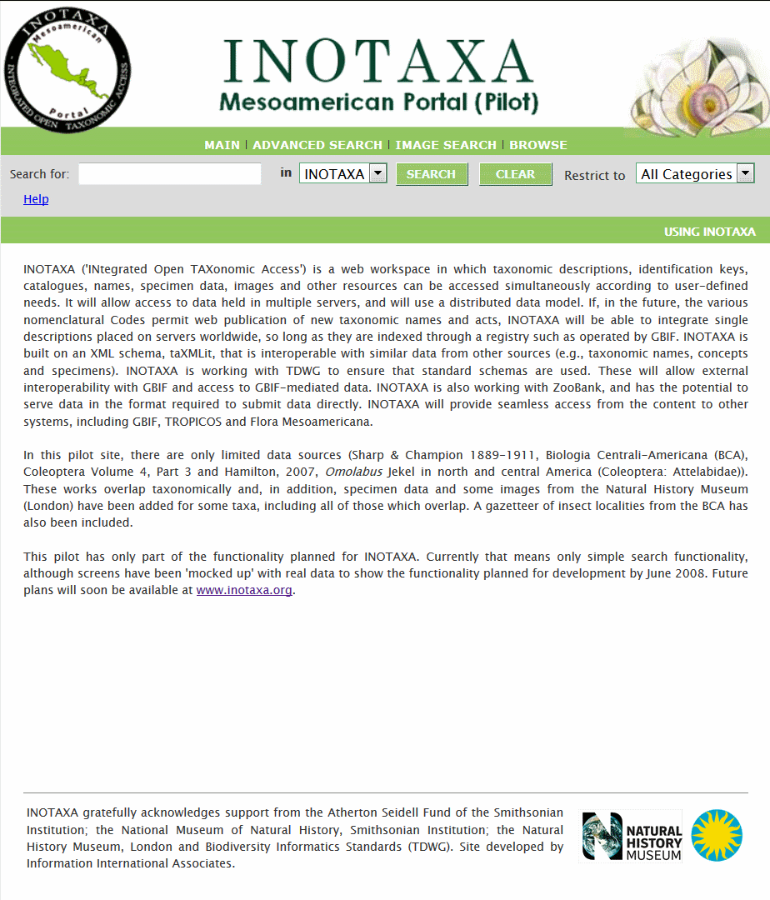

This is an online database system of the *Biologia Centrali-Americana*, based on the XML mark-up of this 64 volume write up of expeditions to Central America at the end of the nineteenth century.

> In other words this mark-up is NOT the product of a digitisation-for-archive project, but of an explicit convert to database project.

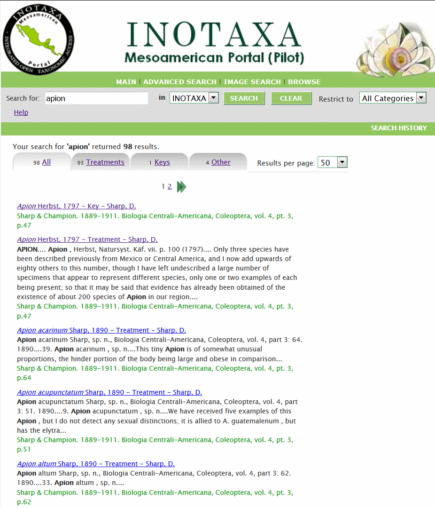

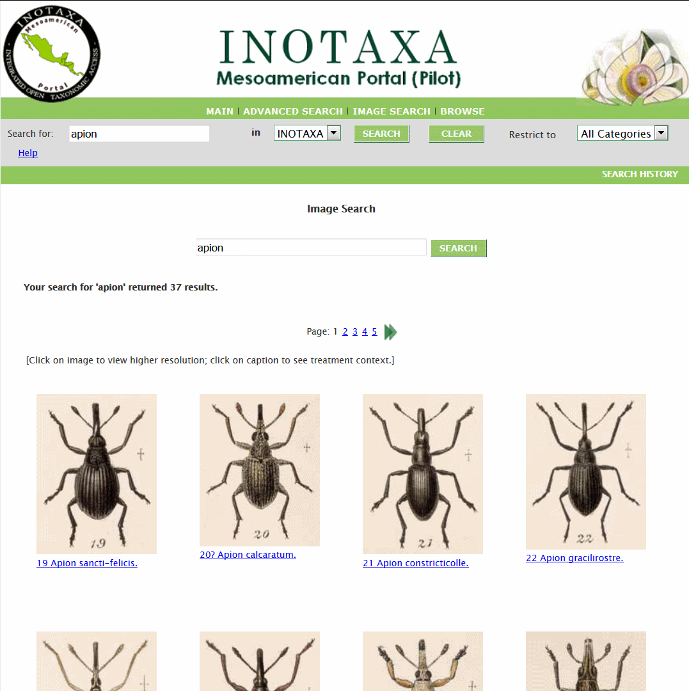

This web site is good example of what can be achieved once structure has been applied to otherwise unstructured text. Applying structure is the process you need to go through when building a database, crafting metadata, or drawing up the tables such as those used in today's exercises, not just when you mark-up text. It is a generalisable skill. 

In the example of INOTAXA, the marked-up text is used in a database. Why convert your structured text to another format, if an XML database meets your requirements? 

A widely used open source XML database, popular in the Digital Humanities, is [BaseX](http://basex.org/). Another good, open source alternative is [SEDNA](http://sednadb.com/). There are commercial offerings too, such as [eXist](http://www.exist-db.org/exist/apps/homepage/index.html).

Marking-up text is very much a task you undertake with the end in mind. Marking-up is labour intensive. You do not want to do more than you have to. The *Biologia Centrali-Americana* was marked-up using taXMLit, a very detailed XML schema.

> Here is an example of the level of detail in taXMLit mark-up.

~~~~~
<Locality>
	<Level0>
		<Level0Text Explicit="false">Central America</Level0Text>
	</Level0>
	<Level1>
		<Level1Text Explicit="false">Guatemala</Level1Text>
		<Level1Interpreted Explicit="false">Guatemala</Level1Interpreted>
	</Level1>
	<Level2>
		<Level2Text Explicit="false"/>
		<Level2Interpreted Explicit="false" Source="Selander &amp; Vaurie, 1962">Oaxaca</Level2Interpreted>
	</Level2>
	<DetailedLocation>
		<DetailedLocationText Explicit="true">Cerro Zunil</DetailedLocationText>
		<DetailedLocationInterpreted Explicit="false" Source="Selander &amp; Vaurie, 1962">Volcán Zunil</DetailedLocationInterpreted>
	</DetailedLocation>
</Locality>
~~~~

> In this example a location is given to three levels; thus permitting three levels of query when accessing geographic locations through the Inotaxa portal. Note the use of *False* for information that is *not* present in the source text. In this example, neither 'Central America' not 'Guatemala' are explicitly referenced in the text, only what the authors refer to as 'Cerro Zunil' and which is now known as 'Volcán Zunil'. Hence, the XML version of the original document has been significantly enhanced. Think of it like marginalia and similar such annotations you might find in the original material!

The schema permits not only to mark-up the text but to annotate it too, adding information that is not directly present in the material but usefully expands it. This intense degree of mark-up proved too much for the authors of INOTAXA to apply to other projects, and they now use a less detailed - but still useful - lightweight derivative called taXMLite.

There are many other XML schemas used by biodiversity researchers, each schema having its own strengths and weaknesses. But then each was developed to meet a specific need. This is one overarching advantage of XML, being extensible; it can be adapted to meet these different needs. Further through the use of namespaces you can apply more than one XML schema to the same file.

Interestingly, though taXMLit is very detailed and complicated, the authors chose not to start from scratch when developing it. Instead, they chose to extend an already established XML schema that successfully provides basic document level mark-up: Text Encoding Initiative (TEI).

 
## Practical XML for Digital Humanities: TEI

[TEI](http://www.tei-c.org/index.xml) in their own words as stated on the consortium's home page:

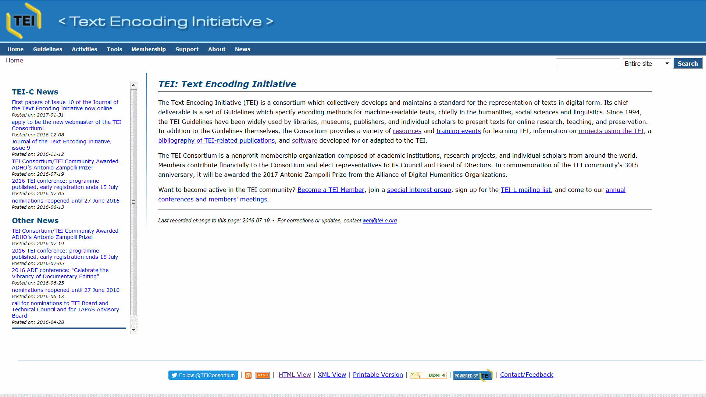

> …a set of Guidelines which specify encoding methods for machine-readable texts, chiefly in the humanities, social sciences and linguistics. Since 1994, the TEI Guidelines have been widely used by libraries, museums, publishers, and individual scholars to present texts for online research, teaching, and preservation.

The main advantage for Digital Humanists is that TEI is the *de facto* standard in the discipline. Hence, there are many resources, conferences and experienced colleagues to call on. TEI has been around for over twenty years, so there is probably some mark-up in it somewhere that already meets your needs!

*There will be a time-out here for you to explore the [TEI guidelines](http://www.tei-c.org/release/doc/tei-p5-doc/en/html/) and for us to discuss them further. There will be time to pursue in-depth questions in this afternoon's final session.*

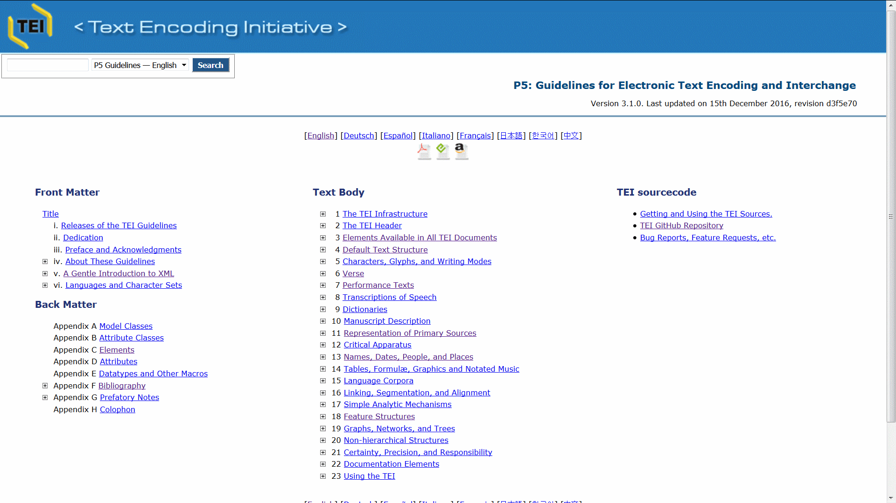

> And some [example projects using TEI](http://www.tei-c.org/Activities/Projects/)

If you do use TEI then catch up with the archive of the [Journal of the Text Encoding Initiative](https://journal.tei-c.org/journal/) and subscribe to the [TEI mailing list](https://listserv.brown.edu/archives/cgi-bin/wa?A0=TEI-L).

Various tools are available for working with XML from specialist XML editors such as [XML Copy Editor](http://xml-copy-editor.sourceforge.net/) to sophisticated environments such as [Editions Visualization Technology](https://sourceforge.net/projects/evt-project/). Many of you might have access to XML tools through your institution, such as the widely used authoring tool [Oxygen XML Editor](http://www.oxygenxml.com/). Do not forget that many text and code editors have XML plug-ins too, for example [Notepad++](https://notepad-plus-plus.org/) and its imaginatively named 'XML Tools' plug-in. 

### An aside on mark-up

In the Digital Humanities you are unlikely to encounter anything other than TEI, and if you do it is probably a similar *inline* XML mark-up of the material, often an extension of TEI. However, in applying the mark-up inline you are necessarily creating a new artefact, embedding the XML tags around the relevant items. For the typical mark-up required by Digital Humanists this has many advantages, there are no problems with version control for example. However, other there are other varieties of inline mark-up, that do not use XML. One such is the output from applying a **PoS tagger** to your text: 

    ('This', 'DT')
    ('is', 'VBZ')
    ('a', 'DT')
    ('simple', 'JJ')
    ('sentence', 'NN')
    ('.', '.')

…the **P**arts **o**f **S**peech tags have been wrapped around each word.

Another approach is to have *stand-off* mark-up, in which the mark-up is in a separate file. This approach leaves the source document untouched. The disadvantage is that you now have to worry about version control, keeping the source document and mark-up documents in step. However, the original document remains readable, and multiple annotations can be applied to it. This does not seem to be a requirement in Digital Humanities, however, it is a requirement in many other domains such as biomedical research. Should it become a requirement in your research then perhaps it will be in your research… 

> From C:\Users\David King\ViBRANT\Corpus\aves_v1\c112.[ann|txt], mark-up of scientific document with full taxonomic rank information
   
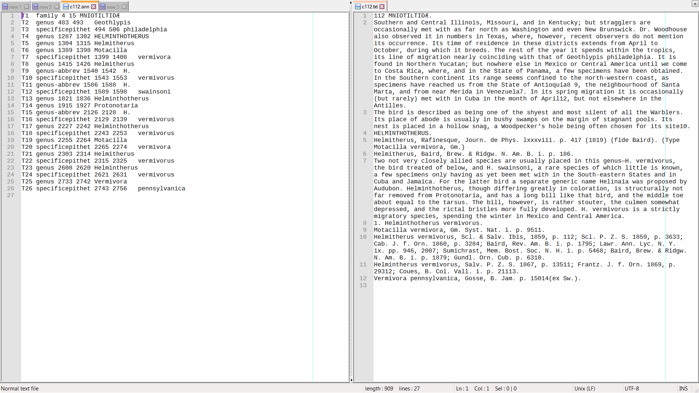

> Allows multiple reuse of original material and overlay of multiple mark-ups.
>
> This style of mark-up when visualised through [BRAT](http://brat.nlplab.org/) shows not only marked-up elements but relations too. 
> [Examples](http://brat.nlplab.org/examples.html)

What we have seen so far in this final session could be described as examples of *information extraction* in that we have known before hand what is in our material, and the task was to apply a structure to that material so that we can work with the information it contains in an effective manner. Now we are going to look at *data mining*, looking for information and patterns in our data that perhaps we don't realise are even present.

## Further tools and techniques for working with text

There are many, many tools for working with text. There is not the time to go through them all in this session. However, there is time to show you how to navigate through choice of tools that are available and identify those that might be useful to your research. Fortunately, there are curated lists to assist us. Here are two excellent lists prepared by humanists:

- [DiRT](http://dirtdirectory.org/) Digital Research Tools

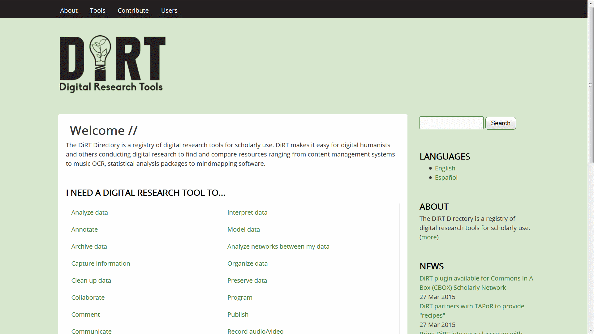
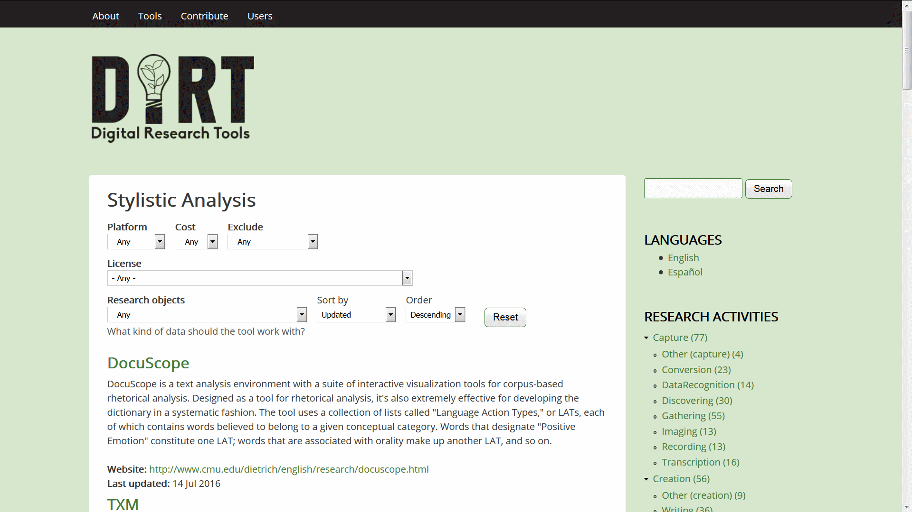

- [TAPoR](http://tapor.ca/home) Text Analysis Portal

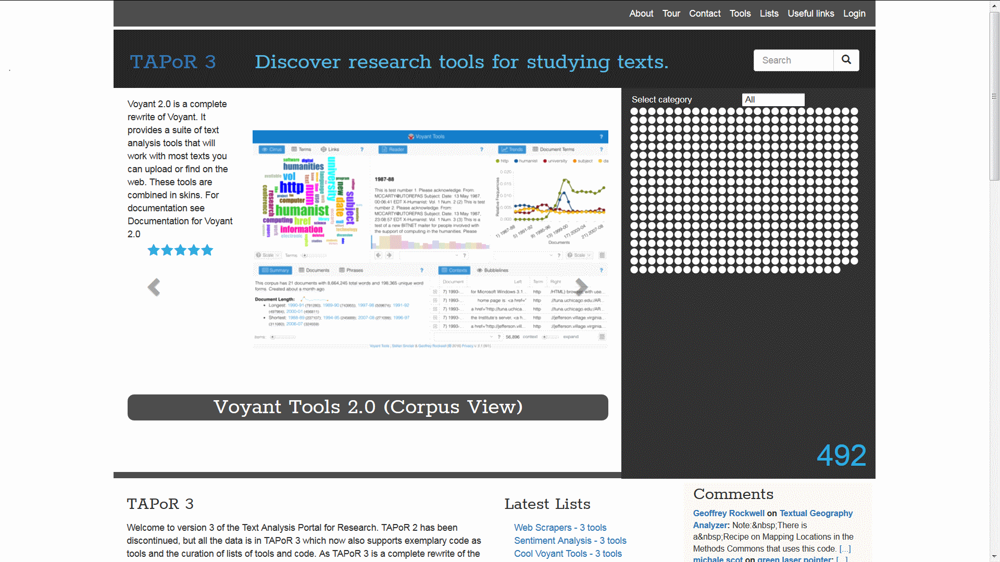

Other lists are available… one of which might be useful but as prepared by a computer scientist: [Awesome Machine Learning](https://github.com/josephmisiti/awesome-machine-learning). It too is an excellent list, but you do need to think differently to make the most of it.

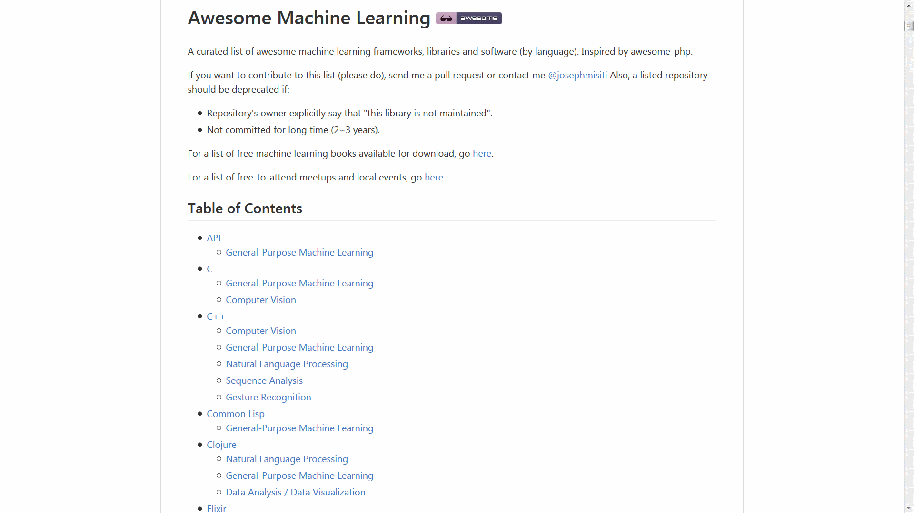

*There will be a time-out here for you to explore these lists for tools and techniques and for us to discuss them further.*

### Assorted tools for the command line

Many of the older tools are written in computer languages that have a relatively steep learning curve should you wish to incorporate the tools into your own programs. Often though the tools come in a command line version so that they can be run directly from a terminal, or incorporated into a workflow and piped together, ie joined by | as you used in the hands-on sessions.

Note, these tools often require the installation of the computer language they were written in, typically Java or Perl.

Two techniques have been mentioned for discussion in this session.

#### Topic modelling

This technique been covered in an earlier workshop in this series, but to recap the leading stand-alone tool for topic modelling is [MALLET](http://mallet.cs.umass.edu/index.php) (**MA**chine **L**earning for **L**anguag**E** **T**oolkit). Topic modelling helps you infer the topics in a set of texts usually by identifying significant keywords and phrases (ones that appear in certain texts only and hence are distinctive), and then grouping those texts that contain the significant terms.

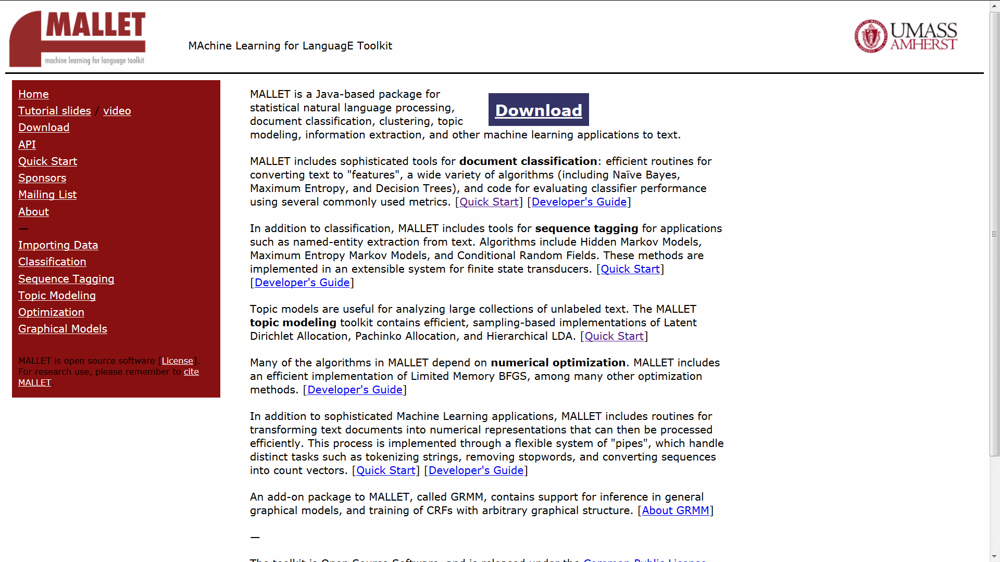

> A word of warning; typically topic modelling classifiers are trained on modern texts - not texts contemporary to the material you are working on. This can affect the tools' results.

Learn more about this technique from at the Programming Historian tutorial on [topic modelling](http://programminghistorian.org/lessons/topic-modeling-and-mallet).

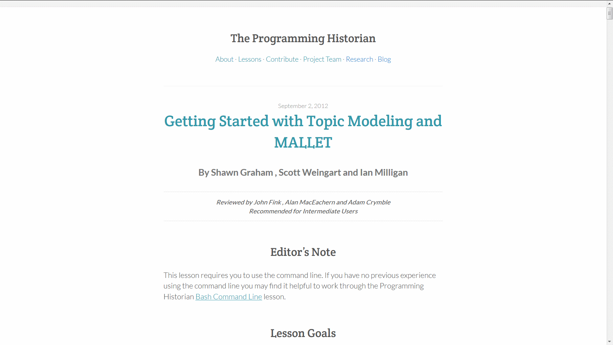

> Note link to Programming Historian's [Introduction to the BASH command line](http://programminghistorian.org/lessons/intro-to-bash) - time for James to take a bow :)

Note, MALLET is a *toolkit* and hence can be used for other tasks. When you explored the lists of digital tools you may have realised that so many of them re-implement the same techniques. Be aware, there is a *strong* tendency among academic computer scientists to suffer from the not-invented-here syndrome. This can lead to outdated versions of techniques becoming fossilised in the toolkit as researchers continue to research, develop and refine the techniques.

> For reference, within Python [gensim](http://radimrehurek.com/gensim/) is probably the best package

#### Parts of speech tagging

The state-of-the-art tool for this technique is produced by the [Stanford Natural Language Processing Group](http://nlp.stanford.edu/). Their tool, and a comprehensive toolkit of other text processing techniques, is available for [download]((http://nlp.stanford.edu/software/).

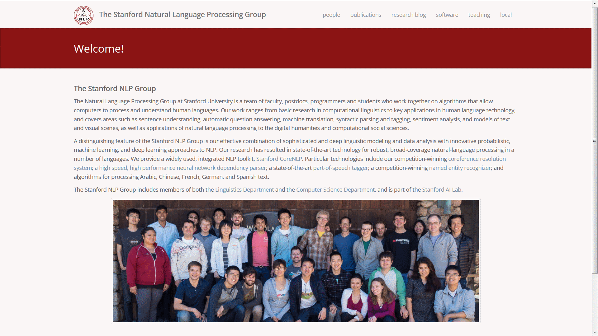

We saw an example of parts of speech tagging earlier, to illustrate non-XML based inline mark-up. As you can see in that example, the output tags each 'word' with its part of speech. Obvious!

Well, maybe not.

Your first challenge is to identify a *word*. How do you break up a text into its components? Different corpora use different techniques so that **didn't** might be:

- left as **didn't**
- or if punctuation is simply removed then it becomes **didnt**
- or if punctuation is replaced with space the it becomes **didn** and **t**
- or it is normalised so that it becomes **did** and **n't**
- or perhaps special rules are applied so that it is expanded to become **did** and **not**
- or something else that is relevant to the research…   

Similarly when dealing with older writing how do we handle old spellings. For example, what we now know as **tomorrow** was **to-morrow** and before that **to** and **morrow**. Language is dynamic. It is up to us to decide how we use it in our research. Is the canonical form more useful to us, or the normalised form? And what of errors in the original text?

This process of breaking text up into its component words is called **tokenization** because you do not necessarily end up with *words* but individual elements that are better described as *tokens*.

Mark-up can be useful at this point because we can include several forms of the same *word* in the document, each appropriately marked-up by a meaningful tag. Hence, we are not committed to one form or the other at this point in time. However, when we come to analyse the document, we must choose which form to use.  

Rather than download the full Stanford NLP toolkit, for now take a few minutes to try the [online](http://nlp.stanford.edu:8080/parser/index.jsp) interface. See how the parser handles: "I refuse to put out the refuse tonight." Have a creative few minutes devising sentences with overloaded words and ambiguous statements.

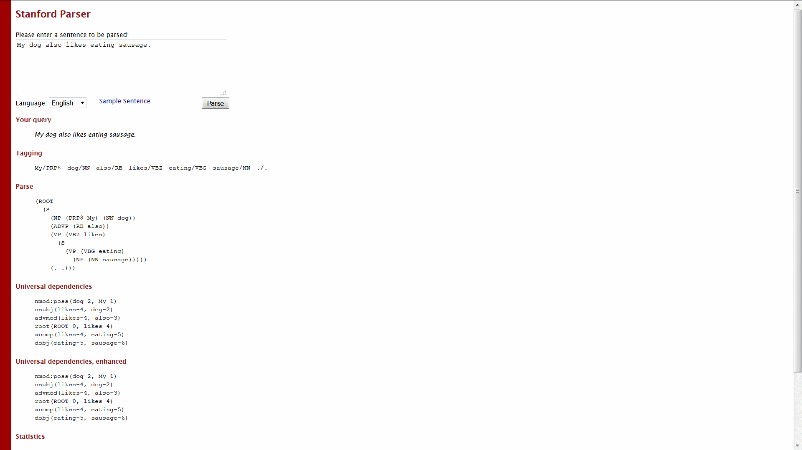

Note, this parser has been trained on contemporary English. It might be interesting to try some older style of writing and see how well the parser performs.

### NLTK

While there are many NLP (Natural Language Processing) toolkits, we are now going to take a closer look at one in particular if you want to write your own scripts: [NLTK](http://www.nltk.org/) Natural Language Toolkit.

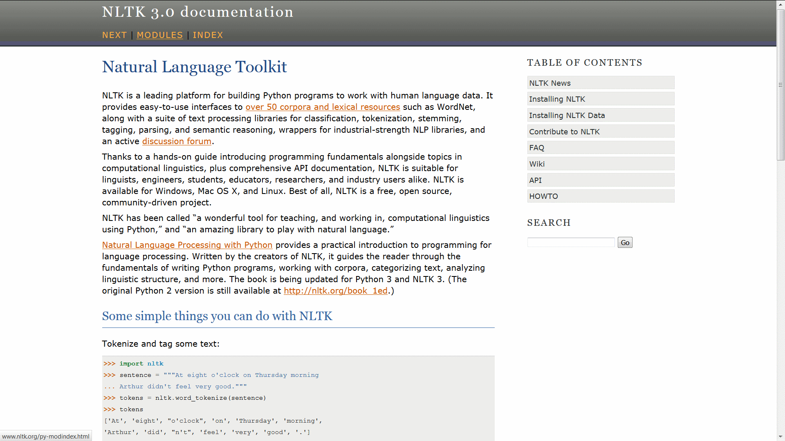

NLTK is strongly recommended because if you feel that NLP techniques will be useful in your research, then this is an especially easy one for you to master. The reason is simple: NLTK began life as a pedagogical project, a toolkit to teach NLP. As such, it is not written in a relatively heavy-weight computer language but in Python. As you may already be aware, Python is very accessible and easy to learn. Yet it is also very powerful and so can scale with your needs if required so does not constrain your future ambitions! In addition, UNIX and Mac operating systems include Python, so there is less software installation and maintenance demanded of you to make the toolkit work.

Another advantage of NLTK's heritage is that being the output from a pedagogical project, there is no issue around re-using other people's tools. For example, NLTK calls the Stanford PoS tagger. Why reinvent/reimplement the tool?

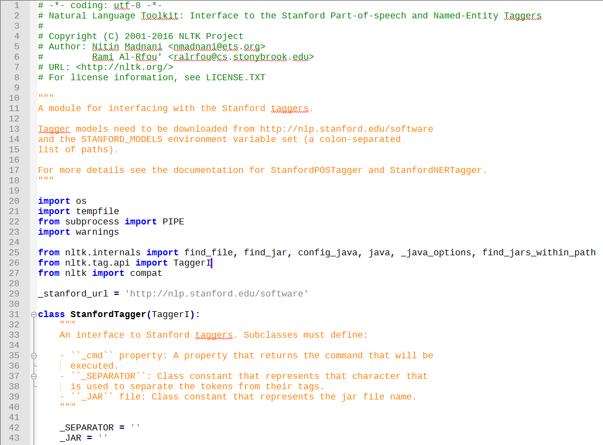

Yet another advantage of NLTK's heritage is its documentation, for which there is an entire book available for free [online](http://www.nltk.org/book/) or at cost in printed format that will introduce you to Python, NLP and NLTK. For example, see what the NLTK book has to say on [tokenization](http://www.nltk.org/book/ch03.html#tokenization_index_term). Also scroll down that web page to section 3.7 to read about using regular expressions to tokenize text. If you follow through NLTK's tokenization routine you will see it handles **$** as a special case. Why not **£**? Or **¥**?

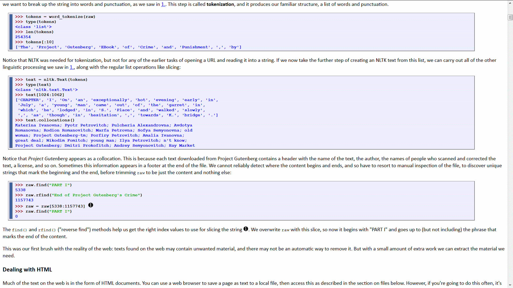

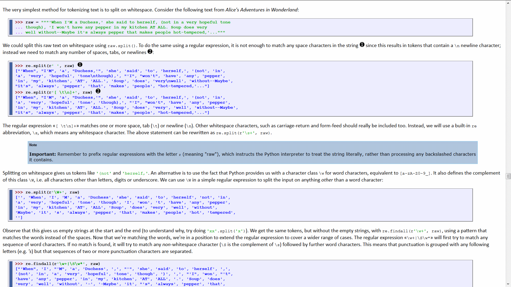

*There will be time now, or if not then in the following session, for a final time-out for a demonstration of how easy NLTK is to use followed by time for you to explore the online book and for us to discuss any questions arising.*

----
## Supported self-directed learning / overflow!

Over to you and your specific research questions.

----
## In closing

We hope this session has given you a useful introduction to working with digital texts, but clearly the subject is far larger than can be covered in one day. So, do feel free to keep in touch and ask questions, and do make use of the [AHDA Google hangouts](https://chasedigitalage.wordpress.com/home-2/201617-programme/google-hangouts/). 

### And finally

There are a couple of potentially useful EU funded projects to mention; they just didn't seem to fit in anywhere earlier. Although the projects are formally infrastructure projects, that does mean they pull together into one place, as well as indirectly supporting the development of, interesting tools. They also organise useful conferences and workshops, and so they are a relatively easy way to keep up-to-date with the latest research outputs. The projects are:

- [Digital Research Infrastructure for the Arts and Humanities](http://www.dariah.eu/)
- [CLARIN - European Research Infrastructure for Language Resources and Technology](https://www.clarin.eu/)
