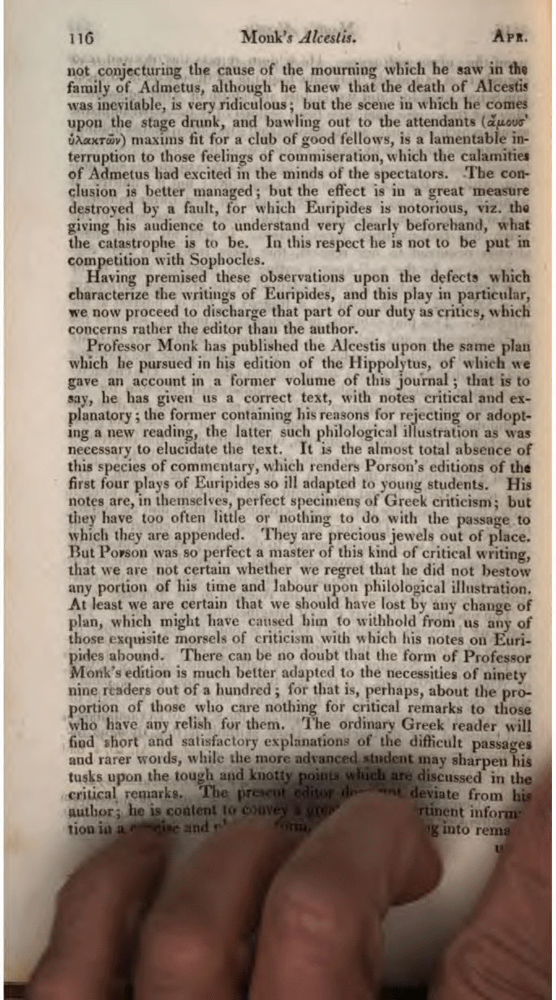
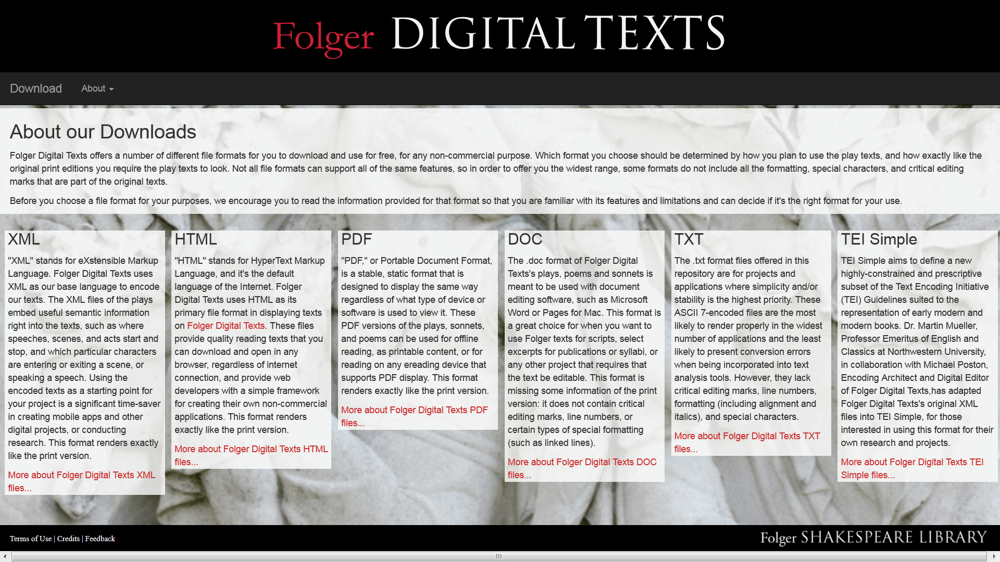
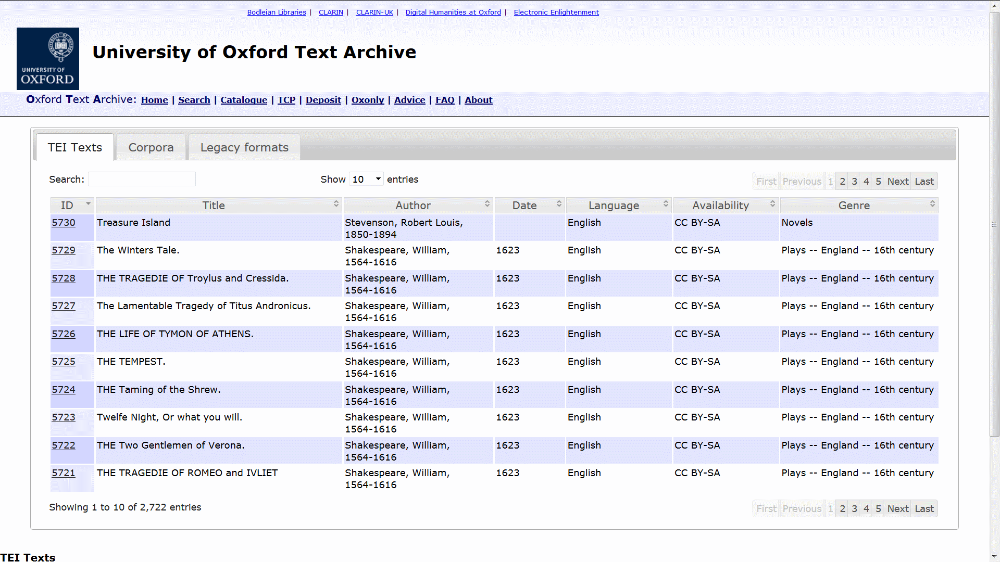

## Introduction AM

> In some ways a recap of Winter School, especially "Building Blocks for Digital Humanities & Text Markup".

What do we mean by "digital texts"?

Well, there are modern, *born-digital* texts, which covers pretty much everything written today including social media content. The latter is a particularly rich vein of research for both social scientists and marketing strategists!

> This research can help fund new methods and techniques, as well as provide careers. For example, digitisation of Irish Depositions from the 1640s part-funded by IBM, who faced identical issues in digitising contemporary Chicago police records.

Then there are older texts that have been "digitised". in that an image has been made of the printed material. Typically the prime motivation behind a digitisation project is to create an archive of the texts. 

> As an aside, I spent time as an undergraduate in the Owen Lattimore collection in Leeds and in the library at SOAS reading archived Chinese newspapers - on microfiche. These documents had no index. I had to read everyone to find out if there was anything relevant. No metadata.

However, once there is an image of the material then all manner of further processing and analysis is possible; some of which we will touch on today.

The output of this analysis leads to the production of yet more *digital texts*. Hence, sometimes when we refer to *digital texts* we are working with the "raw" text 

> Can be very "raw" - a dead wasp anyone? Or as in this example, fingers over the text.
> Real example from the *Quaterly Review*.

in a digital format derived directly by Optical Character Recognition of the image

> quality of OCR has been alluded to in Winter School, particular issue with older texts as material degraded as well font and stylistic quirks. Without context the OCR success rate can be poor. Isolated text such as headings and captions is often different to the rest of the documents, perhaps bold, perhaps a larger, etc. Much better accuracy is achieved when looking at body text, because the OCR engine correctly identifies common word and can validate them in its dictionary, so the confidence for recognising individual characters increases – even for words not in its dictionary such as *Sciurus*, the genus name for squirrel.  
> *Sciurus* 97% accuracy in body text (68 out of 70), 14% accuracy as an isolated word (1 out of 7)  
> Example taken from a project in which I was extracting taxon names from texts.

and sometimes with the text as processed by other projects. This is a potentially important difference for the digital text can take on a life of its own. For example, have spellings been standardised, are hyphens discarded and abbreviations extended?

> Hence, those sections in a TEI header!

We can see examples of these differences by looking at the collection of Shakespeare's plays published online by [Folger DIGITAL TEXTS](http://www.folgerdigitaltexts.org/download/).

> differences explained <http://www.folgerdigitaltexts.org/download/about.html>  
> look at same file in different formats - raw and marked-up, various mark-ups, and pdf  
> possibly have a rant about ASCII - maybe need to revisit this in final session  
> possibly also EOL - James mentions handling this later when cleaning text 

Therefore, as with any material you work on, do be aware of its context. 

### Copyright

While text mining of all materials is now legal under UK law,

> Not always so. Have worked on projects with protracted legal disputes over the right to text mine taxon concepts from texts.

be aware of potential copyright restrictions. This may be not an issue with original material, but curated works derived from that material might be considered as *new* and hence fall under copyright protection. Do check the copyright status of the material you use, do not make assumptions.

> On the whole it is 'better to ask for forgiveness than permission', but why put yourself in a potentially embarrassing position especially as asking to use material is a good excuse to get in touch with the authors and network  

> example of new material with copyright notices <http://ota.ox.ac.uk/catalogue/index.html>  
> CC = Creative Commons  BY = by attribution  SA = share alike  
> [abbreviations explained](https://en.wikipedia.org/wiki/Creative_Commons_license) with additional commentary on Creative Commons, hence linking to Wikipedia rather than CC

Bearing all this in mind, now let's do some analysis of digital texts.
